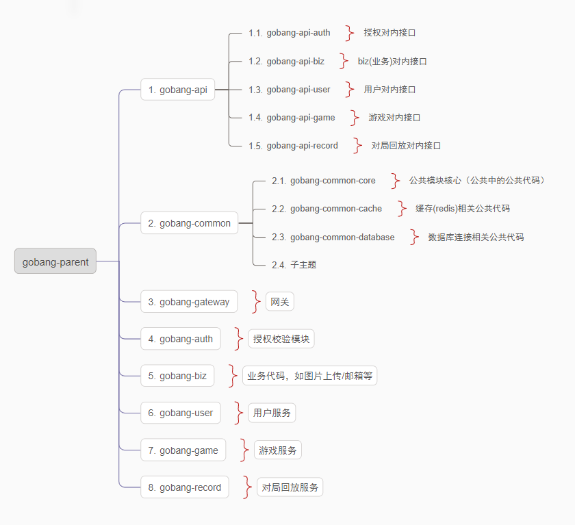

# gobang

graduate design 2023

## project-struct

## SpringCloud-rely

| Spring Cloud Alibaba Version | Spring Cloud Version     | Spring Boot Version |
| ---------------------------- | ------------------------ | ------------------- |
| 2.2.8.RELEASE                | Spring Cloud Hoxton.SR12 | 2.3.12.RELEASE      |

| Spring Cloud Alibaba Version | Sentinel Version | Nacos Version | RocketMQ Version | Dubbo Version | Seata Version |
| ---------------------------- | ---------------- | ------------- | ---------------- | ------------- | ------------- |
| 2.2.8.RELEASE                | 1.8.4            | 2.1.0         | 4.9.3            | ~             | 1.5.1         |

## Project-struct standard

- VO（View Object）：显示层对象，通常是 Web 向模板渲染引擎层传输的对象。
- DTO（Data Transfer Object）：数据传输对象，前端像后台进行传输的对象，类似于param。
- BO（Business Object）：业务对象，内部业务对象，只在内部传递，不对外进行传递。
- Model：模型层，此对象与数据库表结构一一对应，通过 Mapper 层向上传输数据源对象。
- Controller：主要是对外部访问控制进行转发，各类基本参数校验，或者不复用的业务简单处理等。为了简单起见，一些与事务无关的代码也在这里编写。
- FeignClient：由于微服务之间存在互相调用，这里是内部请求的接口。
- Controller：主要是对内部访问控制进行转发，各类基本参数校验，或者不复用的业务简单处理等。为了简单起见，一些与事务无关的代码也在这里编写。
- Service 层：相对具体的业务逻辑服务层。
- Manager 层：通用业务处理层，它有如下特征：
  - 1） 对第三方平台封装的层，预处理返回结果及转化异常信息，适配上层接口。
  - 2） 对 Service 层通用能力的下沉，如缓存方案、中间件通用处理。
  - 3） 与 DAO 层交互，对多个 DAO 的组合复用。
- Mapper持久层：数据访问层，与底层 MySQL进行数据交互。
- Listener：监听 `RocketMQ` 进行处理，有时候会监听`easyexcel`相关数据。

## Service-port

| 服务           | 地址                  |
| -------------- | --------------------- |
| gobang-gateway | http://127.0.0.1:8000 |
| gobang-auth    | http://127.0.0.1:8001 |
| gobang-user    | http://127.0.0.1:8002 |
| gobang-game    | http://127.0.0.1:8003 |
| gobang-record  | http://127.0.0.1:8004 |

## RequestAPI

| service              | api                | describe       | dto                                         | vo         |
| -------------------- | ------------------ | -------------- | ------------------------------------------- | ---------- |
| gobang-gateway(8000) |                    |                |                                             |            |
| gobang-auth(8001)    | /auth/emailCaptcha | 获取邮箱验证码 | {email}                                     | {key}      |
| gobang-user(8002)    | /user/register     | 注册           | {username,password,sex,email,key,emailCode} | {username} |
| gobang-game(8003)    |                    |                |                                             |            |
| gobang-record(8004)  |                    |                |                                             |            |
|                      |                    |                |                                             |            |
|                      |                    |                |                                             |            |
|                      |                    |                |                                             |            |
|                      |                    |                |                                             |            |

